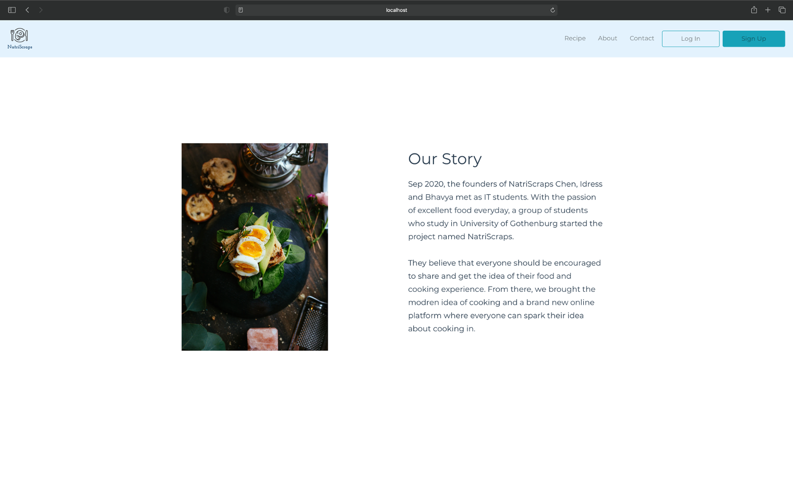

# NutriScraps - your online kitchen

Latest version: https://git.chalmers.se/courses/dit341/2020/group-07-web

## Deploy to Heroku

https://nutri-scraps.herokuapp.com/

## Project Structure

| File                                                 | Purpose                           | What you do?                              |
| ---------------------------------------------------- | --------------------------------- | ----------------------------------------- |
| `server/`                                            | Backend server code               | All your server code                      |
| [server/README.md](server/README.md)                 | Everything about the server       | **READ ME** carefully!                    |
| `client/`                                            | Frontend client code              | All your client code                      |
| [client/README.md](client/README.md)                 | Everything about the client       | **READ ME** carefully!                    |
| [docs/DEPLOYMENT.md](docs/DEPLOYMENT.md)             | Free online production deployment | Deploy your app online in production mode |
| [docs/LOCAL_DEPLOYMENT.md](docs/LOCAL_DEPLOYMENT.md) | Local production deployment       | Deploy your app local in production mode  |

## Requirements

## Getting started

```bash
# Clone repository
git clone git@git.ita.chalmers.se:courses/dit341/2020/group-07-web.git

# Change into the directory
cd group-07-web

# Setup backend
cd server && npm install
npm run dev

# Setup frontend
cd client && npm install
npm run serve
```

> Check out the detailed instructions for [backend](./server/README.md) and [frontend](./client/README.md).

## System Definition

### Purpose

Some of the hardest decisions we make are those that we have to make everyday, multiple times. One such decision is, what should I make for dinner tonight? To tackle this problem we have created the CookingApp (Temp name). The cooking app will help you choose recipes based on what ingredients you have or which ingredients you would like to mix together to create something new. You can also see what recipes other people have created in their own kitchen. 

### Pages

Login Page :users can choose to continue as a guest or  they can login using email and password or they can register for a new account. If the user chooses not to login, some features will not be available to them. 

Home page: Users can see the most liked recipes of the week/month, navbar to navigate to other pages such as “Chopping Board”, Recipes, About Us, Contact Us, Profile

Profile: Users can edit their personal information such as Name, last name, email, password, favorite cuisine, etc. 

About Us: Page about the group, mainly just for viewing

Contact Us: Users can ask for support if they face any difficulties with the website

Recipe: Displays a multitude of recipes provided by the system and the users. Recipes provided by the system have a special badge to show that the recipes have been provided by professionals, recipes made by users can be liked by other users to show that the recipes are popular and delicious. Users can also choose to share their own recipes, they will have a  predesigned form which they can fill. Recipes can be shared with pictures to make them more appealing. 

### To-do

Chopping Board: Users can create a dish they want using a virtual chopping board. They will simply drag the ingredients they would like to use onto a chopping board. The system will search for recipes that correspond to the ingredients placed by the user onto the chopping board. 

### Entity-Relationship (ER) Diagram


## Teaser (MS3)


