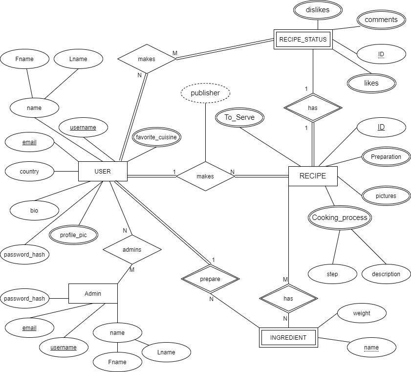

# Backend and Frontend Template

Latest version: https://git.ita.chalmers.se/courses/dit341/group-00-web (public Github [mirror](https://github.com/dit341/group-00-web))

## Project Structure

| File                                                 | Purpose                           | What you do?                              |
| ---------------------------------------------------- | --------------------------------- | ----------------------------------------- |
| `server/`                                            | Backend server code               | All your server code                      |
| [server/README.md](server/README.md)                 | Everything about the server       | **READ ME** carefully!                    |
| `client/`                                            | Frontend client code              | All your client code                      |
| [client/README.md](client/README.md)                 | Everything about the client       | **READ ME** carefully!                    |
| [docs/DEPLOYMENT.md](docs/DEPLOYMENT.md)             | Free online production deployment | Deploy your app online in production mode |
| [docs/LOCAL_DEPLOYMENT.md](docs/LOCAL_DEPLOYMENT.md) | Local production deployment       | Deploy your app local in production mode  |

## Requirements

The version numbers in brackets indicate the tested versions but feel free to use more recent versions.
You can also use alternative tools if you know how to configure them (e.g., Firefox instead of Chrome).

- [Git](https://git-scm.com/) (v2) => [installation instructions](https://www.atlassian.com/git/tutorials/install-git)
  - [Add your Git username and set your email](https://docs.gitlab.com/ce/gitlab-basics/start-using-git.html#add-your-git-username-and-set-your-email)
    - `git config --global user.name "YOUR_USERNAME"` => check `git config --global user.name`
    - `git config --global user.email "email@example.com"` => check `git config --global user.email`
  - > **Windows users**: We recommend to use the [Git Bash](https://www.atlassian.com/git/tutorials/git-bash) shell from your Git installation or the Bash shell from the [Windows Subsystem for Linux](https://docs.microsoft.com/en-us/windows/wsl/install-win10) to run all shell commands for this project.
- [Chalmers GitLab](https://git.ita.chalmers.se/) => Login with your **Chalmers CID** choosing "Sign in with" **Chalmers Login**. (contact [support@chalmers.se](mailto:support@chalmers.se) if you don't have one)
  - DIT341 course group: https://git.ita.chalmers.se/courses/dit341
  - [Setup SSH key with Gitlab](https://docs.gitlab.com/ee/ssh/)
    - Create an SSH key pair `ssh-keygen -t ed25519 -C "email@example.com"` (skip if you already have one)
    - Add your public SSH key to your Gitlab profile under https://git.ita.chalmers.se/profile/keys
    - Make sure the email you use to commit is registered under https://git.ita.chalmers.se/profile/emails
  - Checkout the [Backend-Frontend](https://git.ita.chalmers.se/courses/dit341/group-00-web) template `git clone git@git.ita.chalmers.se:courses/dit341/group-00-web.git`
- [Server Requirements](./server/README.md#Requirements)
- [Client Requirements](./client/README.md#Requirements)

## Getting started

```bash
# Clone repository
git clone git@git.ita.chalmers.se:courses/dit341/group-00-web.git

# Change into the directory
cd group-00-web

# Setup backend
cd server && npm install
npm run dev

# Setup frontend
cd client && npm install
npm run serve
```

> Check out the detailed instructions for [backend](./server/README.md) and [frontend](./client/README.md).

## Visual Studio Code (VSCode)

Open the `server` and `client` in separate VSCode workspaces or open the combined [backend-frontend.code-workspace](./backend-frontend.code-workspace). Otherwise, workspace-specific settings don't work properly.

## System Definition (MS0)

### Purpose

Some of the hardest decisions we make are those that we have to make everyday, multiple times. One such decision is, what should I make for dinner tonight? To tackle this problem we have created the CookingApp (Temp name). The cooking app will help you choose recipes based on what ingredients you have or which ingredients you would like to mix together to create something new. You can also see what recipes other people have created in their own kitchen. 

### Pages

Login Page :users can choose to continue as a guest or  they can login using email and password or they can register for a new account. If the user chooses not to login, some features will not be available to them. 

Home page: Users can see the most liked recipes of the week/month, navbar to navigate to other pages such as “Chopping Board”, Recipes, About Us, Contact Us, Profile

Profile: Users can edit their personal information such as Name, last name, email, password, favorite cuisine, etc. 

About Us: Page about the group, mainly just for viewing

Contact Us: Users can ask for support if they face any difficulties with the website

Chopping Board: Users can create a dish they want using a virtual chopping board. They will simply drag the ingredients they would like to use onto a chopping board. The system will search for recipes that correspond to the ingredients placed by the user onto the chopping board. 

Recipe: Displays a multitude of recipes provided by the system and the users. Recipes provided by the system have a special badge to show that the recipes have been provided by professionals, recipes made by users can be liked by other users to show that the recipes are popular and delicious. Users can also choose to share their own recipes, they will have a  predesigned form which they can fill. Recipes can be shared with pictures to make them more appealing. 

### Entity-Relationship (ER) Diagram



## Teaser (MS3)


